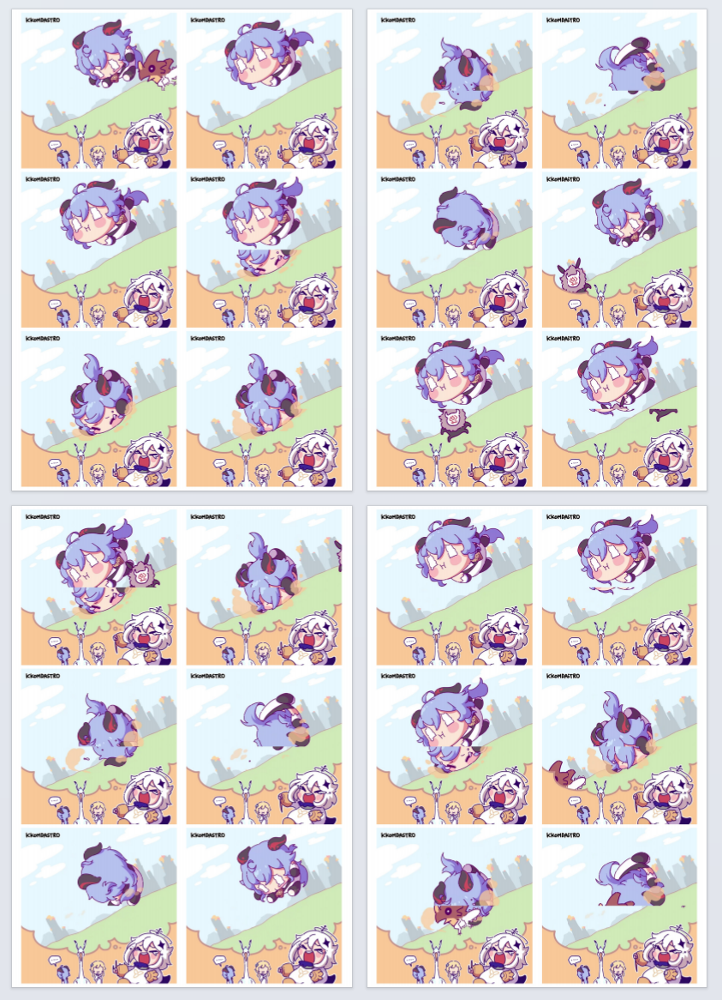

# 视频帧提取器，为了方便翻页动画机的制作

在制作翻页动画机时需要提取视频的关键帧, 并且需要将视频关键帧进行交错拼接, 最后排版到A4纸上打印, 本项目可以按照用户的配置一键完成上述所有操作.

## 安装

你需要创建一个 python 虚拟环境并且安装需要的依赖

```shell
$ python -m venv .venv
$ source .venv/bin/activate
(.venv) $ pip install --upgrade pip
(.venv) $ pip install -r requirements.txt
```

## 用法

必须要至少指定一个视频文件, 可以设置输出路径, 提取的帧数量, 以及最终打印出来的图片尺寸

``` shell
$ python extractor.py -h 
usage: extractor.py [-h] -v vidio_file [-o output_dir] [-f frame_count] [-s (height,width)]

Extract the frames in the video and generate preview video, splice the top half of the frame with the bottom half and generate a printed pdf file.       

options:
  -h, --help            show this help message and exit
  -v vidio_file, --video vidio_file
                        Set the video files to be processed
  -o output_dir, --output-root output_dir
                        Set the root directory for the output video (default: ./extracted_frames)
  -f frame_count, --frame frame_count
                        The total number of video frames extracted (default: extract all frames)
  -s (height,width), --size (height,width)
                        Set the (height,width) of the output frame in mm, the dpi is 300 (default: 96mm)

```

## 例子

目录 `test_video` 下包含了两个用于功能测试的视频 `ganyu.mp4`, `anhunqu.mp4`

### 提取 `ganyu.mp4`

按照总共24帧, 提取出的图片最终大小为96mm * 96mm提取视频

``` shell
(.venv) $ python extractor.py -f 24 -s (96,96) -v test_vedio/ganyu.mp4

#. Video  file path      : test_video/ganyu.mp4
#. Video  file size      : (height=1080px, width=1080px)
#. Video  file second    : 2.966666666666667
#. Video  file fps       : 30.0
#. Video  file frams     : 89
#. Output file frams     : 24
#. Output file size      : (height=1134px, width=1134px)
#. Output file size      : (height=96.0mm, width=96.0mm)
#. Output file dir       : extracted_frames\output_ganyu
Extract frame: 100%|███████████████████████████| 89/89 [00:03<00:00, 28.20it/s] 
Composite frame: 100%|█████████████████████████| 24/24 [00:01<00:00, 13.20it/s] 
Generate pdf: 100%|██████████████████████████████| 5/5 [00:00<00:00,  7.72it/s]
```

运行完成后可以到 `extracted_frames\output_ganyu` 目录下查看生成的文件

`frame` 文件夹是根据用户设置的提取帧数量从视频中提取的视频帧
`frame_top` `frame_bottom` 是将提取出的视频上进行上下半分割后的结果
`frame_offset` 是将分割的两部分进行错位拼接后的结果
`frame_offset_resize` 是将拼接完成后的图片缩放为用户设置的打印尺寸
`frame_pdf` 是将修改好的图片排版拼接到一张 A4 纸之后的结果

`output.pdf` 是生成的用于打印的文件
`output.mp4` 是根据用户设置的帧数的重新生成的预览视频


最终呈现的结果如下图


